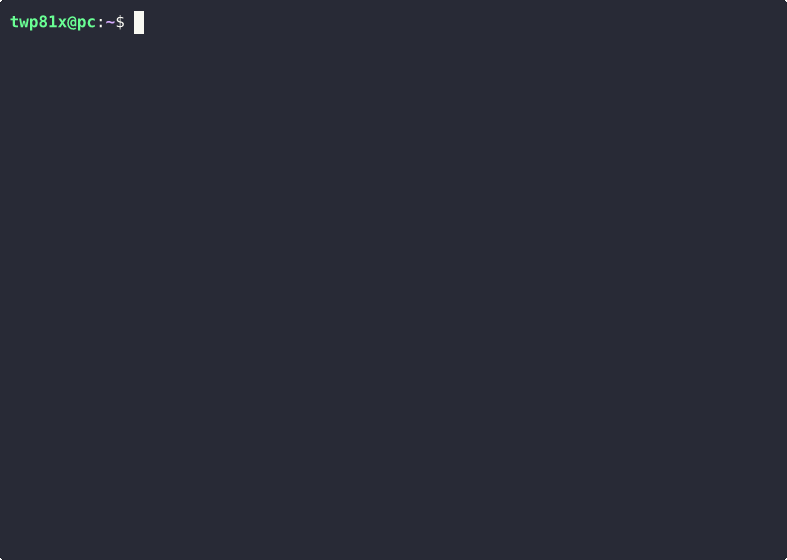

# ShadowScript

**ShadowScript** is a Python-based utility that transforms standard shell scripts into silent, background processes that execute without interruptions or visible output. By encoding the input shell script into a Base64-encoded payload, ShadowScript generates a new shell script that runs discreetly using `nohup`, redirecting all output to `/dev/null`. This makes it ideal for workflow automation, background task execution, or educational purposes where minimal user interaction is desired.



### Features
- Silent execution of shell scripts in the background.
- Base64 encoding for clean script execution.
- Optional `#!/bin/sh` shebang for compatibility.
- Easy-to-use command-line interface with `argparse`.

### Use Case
ShadowScript is perfect for automating repetitive tasks, deploying scripts in environments requiring minimal user interaction, or learning about encoding and process management in shell scripting.

### Ethical Use Disclaimer
This tool is intended for **ethical and lawful use only**, such as workflow automation or educational exploration. It is **not** designed for malicious activities, such as creating malware or evading security measures. Users are responsible for ensuring compliance with all applicable laws and platform policies.

### Installation
Clone the repository:
```
git clone https://github.com/7wp81x/ShadowScript.git
cd ShadowScript
```

Usage:
```python3 shadowscript.py -f example.sh -o silent_script.sh```
